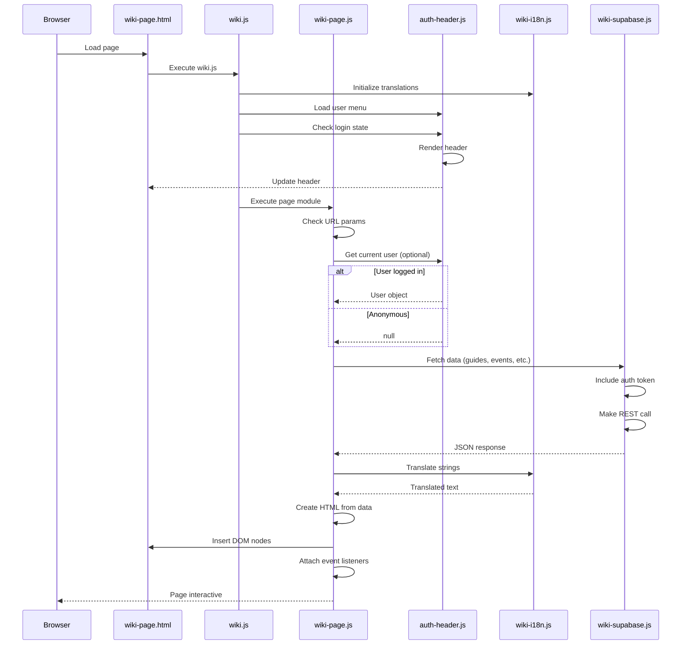
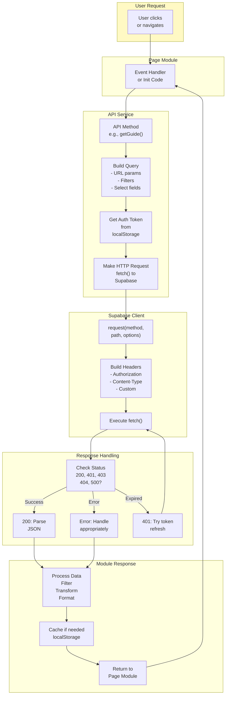
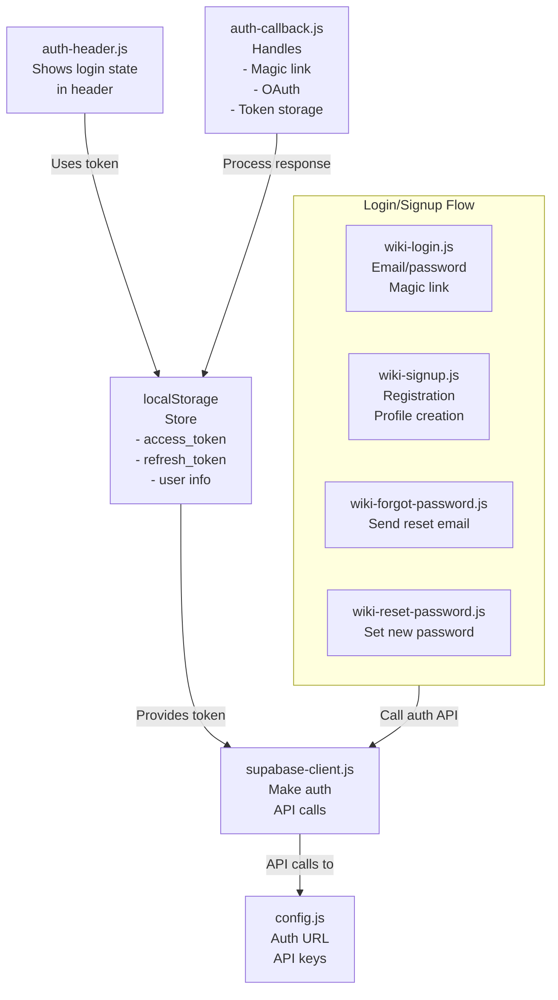
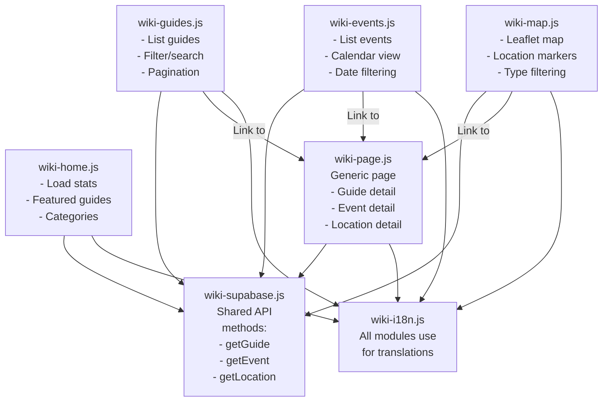
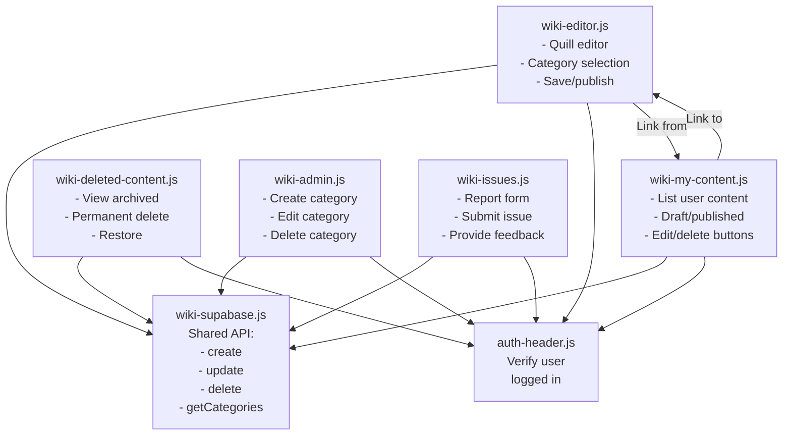
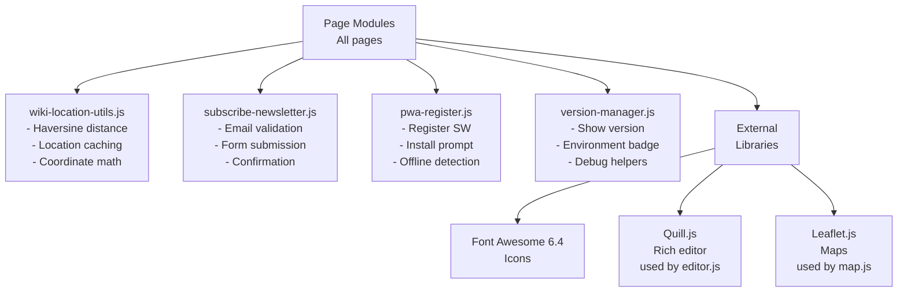

# Wiki Component Architecture

**File:** `/docs/architecture/WIKI_COMPONENT_ARCHITECTURE.md`

**Description:** Detailed component organization, module dependencies, and frontend architecture for the Permahub Wiki

**Author:** Libor Ballaty <libor@arionetworks.com>

**Created:** 2025-11-21

---

## Overview

This document describes:
- Complete module organization and dependencies
- Component hierarchy and relationships
- Page-specific module structure
- Shared utilities and services
- Module import patterns

---

## Diagram 1: Complete Module Dependency Graph

```mermaid
graph TB
    subgraph Config["Configuration Layer"]
        config["config.js<br/>- Supabase URL<br/>- API keys<br/>- Env detection"]
    end

    subgraph CoreSupabase["Core Supabase"]
        client["supabase-client.js<br/>- HTTP wrapper<br/>- REST API calls<br/>- Token mgmt"]
    end

    subgraph WikiCore["Wiki Core Services"]
        i18n["wiki-i18n.js<br/>- Translations<br/>- Language switching<br/>- ~4500 keys"]

        supabaseAPI["wiki-supabase.js<br/>- Domain API<br/>- Guides, Events, Locations<br/>- Search, filters"]

        wiki["wiki.js<br/>- Page init<br/>- Header setup<br/>- Mobile menu"]
    end

    subgraph Auth["Authentication"]
        authHeader["auth-header.js<br/>- User menu<br/>- Login/logout button<br/>- Login state"]

        authCallback["auth-callback.js<br/>- Handle magic link<br/>- OAuth callback<br/>- Token storage"]

        login["wiki-login.js<br/>- Login form<br/>- Password reset<br/>- Magic link"]

        signup["wiki-signup.js<br/>- Registration form<br/>- Email verify<br/>- Profile setup"]

        forgot["wiki-forgot-password.js<br/>- Password recovery<br/>- Send reset email"]

        reset["wiki-reset-password.js<br/>- Reset password<br/>- New password entry"]

        unsubscribe["wiki-unsubscribe.js<br/>- Unsubscribe form<br/>- Email preferences"]
    end

    subgraph Pages["Page Modules"]
        home["wiki-home.js<br/>- Load categories<br/>- Load featured<br/>- Display stats"]

        guides["wiki-guides.js<br/>- List guides<br/>- Filter by category<br/>- Theme browsing"]

        page["wiki-page.js<br/>- Display guide/event/location<br/>- Load author<br/>- Show metadata"]

        events["wiki-events.js<br/>- List events<br/>- Calendar view<br/>- Date filter"]

        map["wiki-map.js<br/>- Leaflet map<br/>- Load locations<br/>- Filter by type"]

        editor["wiki-editor.js<br/>- Quill editor<br/>- Load categories<br/>- Handle save"]

        myContent["wiki-my-content.js<br/>- List user content<br/>- Edit/delete<br/>- View drafts"]

        deleted["wiki-deleted-content.js<br/>- Show archived<br/>- Restore option<br/>- Permanent delete"]

        favorites["wiki-favorites.js<br/>- List favorites<br/>- Manage collections<br/>- Share collections"]

        admin["wiki-admin.js<br/>- CRUD categories<br/>- Manage taxonomy<br/>- View stats"]

        issues["wiki-issues.js<br/>- Report form<br/>- Issue details<br/>- Submission"]

        about["wiki-about.html<br/>Static page"]

        privacy["wiki-privacy.html<br/>Static page"]

        terms["wiki-terms.html<br/>Static page"]
    end

    subgraph Utilities["Utilities"]
        locationUtils["wiki-location-utils.js<br/>- Distance calc<br/>- Haversine<br/>- Location cache"]

        newsletter["subscribe-newsletter.js<br/>- Subscribe form<br/>- Email validation<br/>- Submission"]

        pwa["pwa-register.js<br/>- Register SW<br/>- Installation prompt<br/>- Offline support"]

        version["version-manager.js<br/>- Version display<br/>- Env badge<br/>- Debug info"]
    end

    subgraph External["External Libraries"]
        fa["Font Awesome 6.4<br/>Icon library"]

        quill["Quill.js<br/>Rich text editor"]

        leaflet["Leaflet.js<br/>Map library"]
    end

    config --> client
    client --> i18n
    client --> supabaseAPI
    client --> wiki

    wiki --> authHeader
    wiki --> i18n

    authCallback --> client
    login --> client
    signup --> client
    forgot --> client
    reset --> client
    unsubscribe --> client

    home --> supabaseAPI
    home --> i18n
    home --> authHeader

    guides --> supabaseAPI
    guides --> i18n
    guides --> locationUtils

    page --> supabaseAPI
    page --> i18n
    page --> authHeader

    events --> supabaseAPI
    events --> i18n

    map --> supabaseAPI
    map --> locationUtils
    map --> leaflet

    editor --> supabaseAPI
    editor --> i18n
    editor --> quill

    myContent --> supabaseAPI
    myContent --> authHeader

    deleted --> supabaseAPI
    deleted --> authHeader

    favorites --> supabaseAPI
    favorites --> i18n

    admin --> supabaseAPI
    admin --> authHeader

    issues --> supabaseAPI
    issues --> authHeader

    pwa --> version
    newsletter --> client

    style config fill:#fff3e0
    style CoreSupabase fill:#ffcdd2
    style WikiCore fill:#c8e6c9
    style Auth fill:#bbdefb
    style Pages fill:#e1f5ff
    style Utilities fill:#f3e5f5
    style External fill:#fce4ec
```



---

## Diagram 2: Page Initialization Sequence



---

## Diagram 3: Core Services Architecture



---

## Diagram 4: Module Organization by Responsibility

```mermaid
graph TB
    subgraph System["System Layer"]
        config_sys["config.js"]
        client_sys["supabase-client.js"]
        version_sys["version-manager.js"]
    end

    subgraph Core["Core Layer"]
        i18n_core["wiki-i18n.js"]
        supabase_core["wiki-supabase.js"]
        wiki_core["wiki.js"]
    end

    subgraph UI["UI/Component Layer"]
        authHeader_ui["auth-header.js"]
        authCallback_ui["auth-callback.js"]
    end

    subgraph Feature["Feature Modules"]
        auth_feat["Authentication<br/>- login.js<br/>- signup.js<br/>- forgot.js<br/>- reset.js"]

        content_feat["Content<br/>- home.js<br/>- guides.js<br/>- page.js<br/>- events.js<br/>- map.js"]

        creation_feat["Creation<br/>- editor.js<br/>- my-content.js<br/>- admin.js"]

        user_feat["User<br/>- favorites.js<br/>- deleted.js<br/>- issues.js<br/>- unsubscribe.js"]
    end

    subgraph Utility["Utility Layer"]
        location_util["location-utils.js"]
        newsletter_util["newsletter.js"]
        pwa_util["pwa-register.js"]
    end

    System --> Core
    Core --> UI
    UI --> Feature
    Feature --> Utility

    style System fill#fff3e0
    style Core fill#c8e6c9
    style UI fill#e1f5ff
    style Feature fill#bbdefb
    style Utility fill#f3e5f5
```



---

## Diagram 5: Data Flow Through Modules

```mermaid
graph LR
    User["User<br/>Interaction"]

    Page["Page Module<br/>wiki-page.js"]

    API["Wiki API<br/>wiki-supabase.js"]

    Client["Supabase Client<br/>supabase-client.js"]

    Config["Config<br/>config.js"]

    I18n["i18n<br/>wiki-i18n.js"]

    Auth["Auth Header<br/>auth-header.js"]

    Network["Network<br/>REST API"]

    DB["Database<br/>Supabase"]

    User -->|1. Click/Event| Page

    Page -->|2. Call API<br/>method| API

    API -->|3. Needs<br/>config| Config
    Config -->|Config object| API

    API -->|4. Get token| Auth
    Auth -->|5. Read from<br/>localStorage| API

    API -->|6. Make HTTP<br/>request| Client

    Client -->|7. fetch()| Network

    Network -->|8. REST<br/>call| DB

    DB -->|9. Query<br/>results| Network

    Network -->|10. JSON<br/>response| Client

    Client -->|11. Return<br/>response| API

    API -->|12. Transform<br/>data| Page

    API -->|13. Get<br/>translations| I18n
    I18n -->|14. Translated<br/>text| API

    API -->|15. Return<br/>data| Page

    Page -->|16. Render<br/>HTML| User

    style User fill:#fff9c4
    style Page fill#e1f5ff
    style API fill#fff3e0
    style Client fill#f3e5f5
    style Network fill#ffe0b2
    style DB fill#fce4ec
```

---

## Diagram 6: Authentication Module Hierarchy



---

## Diagram 7: Content Module Organization



---

## Diagram 8: Creation & Management Module Organization



---

## Diagram 9: Utility Modules & External Dependencies



---

## Module Directory Structure

```
/src/
├── js/
│   ├── config.js                      # Configuration (Environment, URLs, Keys)
│   ├── supabase-client.js             # Core Supabase REST client
│   ├── version-manager.js             # Version display utility
│   └── i18n-translations.js           # All translation data (~4500 keys)
│
└── wiki/
    ├── js/
    │   ├── wiki-i18n.js               # Translation system initialization
    │   ├── wiki.js                    # Shared page initialization
    │   ├── wiki-supabase.js           # Wiki-specific API wrapper
    │   ├── auth-header.js             # Shared header component
    │   ├── auth-callback.js           # Auth callback handler
    │   │
    │   ├── wiki-home.js               # Home page module
    │   ├── wiki-guides.js             # Guides browser module
    │   ├── wiki-page.js               # Generic page viewer
    │   ├── wiki-events.js             # Events list module
    │   ├── wiki-map.js                # Map view module
    │   ├── wiki-editor.js             # Content editor module
    │   ├── wiki-my-content.js         # User content dashboard
    │   ├── wiki-deleted-content.js    # Deleted items archive
    │   ├── wiki-favorites.js          # Favorites & collections
    │   ├── wiki-admin.js              # Category management
    │   ├── wiki-issues.js             # Issue reporting
    │   │
    │   ├── wiki-login.js              # Login form
    │   ├── wiki-signup.js             # Signup form
    │   ├── wiki-forgot-password.js    # Password recovery
    │   ├── wiki-reset-password.js     # Password reset
    │   ├── wiki-unsubscribe.js        # Newsletter unsubscribe
    │   │
    │   ├── wiki-location-utils.js     # Haversine, location helpers
    │   ├── subscribe-newsletter.js    # Newsletter subscription
    │   └── pwa-register.js            # PWA registration
    │
    ├── css/
    │   └── wiki.css                   # All styling (1000+ lines)
    │
    └── html pages (21 files)
        ├── wiki-home.html
        ├── wiki-guides.html
        ├── wiki-page.html
        ├── wiki-events.html
        ├── wiki-map.html
        ├── wiki-editor.html
        ├── wiki-my-content.html
        ├── wiki-deleted-content.html
        ├── wiki-favorites.html
        ├── wiki-admin.html
        ├── wiki-issues.html
        ├── wiki-login.html
        ├── wiki-signup.html
        ├── wiki-forgot-password.html
        ├── wiki-reset-password.html
        ├── wiki-unsubscribe.html
        ├── wiki-about.html
        ├── wiki-privacy.html
        ├── wiki-terms.html
        └── offline.html
```

---

## Module Interfaces (Key Exports)

### wiki-supabase.js
```javascript
// Main API class
class WikiSupabaseAPI {
    // Content retrieval
    getGuidesPublished(filters)
    getGuideBySlug(slug)
    getEventsPublished(filters)
    getLocationsByType(type)
    getCategories()

    // Content creation/modification
    createGuide(data)
    updateGuide(id, data)
    createEvent(data)
    updateEvent(id, data)
    createLocation(data)
    updateLocation(id, data)

    // User features
    addFavorite(userId, contentType, contentId)
    removeFavorite(userId, contentType, contentId)
    getUserFavorites(userId)
    createCollection(userId, name, description)
    addToCollection(collectionId, contentType, contentId)

    // Search and filtering
    searchGuides(query, filters)
    getRelatedContent(slug, contentType)
}
```

### wiki-i18n.js
```javascript
// Initialization and translation
class I18nSystem {
    init(language)
    t(key, defaultValue)
    getCurrentLanguage()
    setLanguage(language)
    getAvailableLanguages()
    translateDate(timestamp)
    translateNumber(number)
}
```

### auth-header.js
```javascript
// Authentication state in header
{
    getCurrentUser()          // Returns user object or null
    isLoggedIn()              // Returns boolean
    logout()                  // Signs out user
    updateUserDisplay()       // Refreshes UI
}
```

---

## Related Documents

- [WIKI_SYSTEM_ARCHITECTURE.md](./WIKI_SYSTEM_ARCHITECTURE.md) - System integration
- [WIKI_DATA_MODEL.md](./WIKI_DATA_MODEL.md) - Database models
- [WIKI_FRONTEND_DESIGN.md](./WIKI_FRONTEND_DESIGN.md) - UI/UX design
- [WIKI_USER_FLOWS.md](./WIKI_USER_FLOWS.md) - User interactions

---

**Status:** Complete

**Last Review:** 2025-11-21
