# Wiki Data Model Architecture

**File:** `/docs/architecture/WIKI_DATA_MODEL.md`

**Description:** Database schema, entity relationships, and data flow diagrams for the Permahub Wiki

**Author:** Libor Ballaty <libor@arionetworks.com>

**Created:** 2025-11-21

---

## Overview

This document contains detailed entity-relationship diagrams and data flow specifications for the wiki database layer, showing:
- Entity relationships and cardinality
- Core content tables and structure
- Multi-language translation support
- User interaction features (favorites, collections)
- Data integrity constraints

---

## Diagram 1: Entity-Relationship Model - Core Content


---

## Diagram 2: Content Type Hierarchy

```mermaid
graph TD
    Content["Content<br/>(Base Concept)"]

    Guide["Guide<br/>📚<br/>- Article<br/>- How-to<br/>- Tutorial"]

    Event["Event<br/>📅<br/>- Workshop<br/>- Meetup<br/>- Course"]

    Location["Location<br/>📍<br/>- Farm<br/>- Garden<br/>- Business"]

    Content --> Guide
    Content --> Event
    Content --> Location

    Guide -->|"has many"| Category["Categories"]
    Guide -->|"has many"| Comment["Comments<br/>(future)"]
    Guide -->|"can be"| Favorite["Favorited"]
    Guide -->|"can be in"| Collection["Collection"]

    Event -->|"has"| Date["event_date"]
    Event -->|"has"| Time["start_time,<br/>end_time"]
    Event -->|"has"| Contact["contact_email,<br/>contact_phone"]
    Event -->|"can be"| Favorite
    Event -->|"can be in"| Collection

    Location -->|"has"| Geo["latitude,<br/>longitude"]
    Location -->|"has"| Hours["opening_hours<br/>(JSONB)"]
    Location -->|"has"| Contact
    Location -->|"can be"| Favorite
    Location -->|"can be in"| Collection

    Favorite -->|"belongs to"| User["User"]
    Collection -->|"belongs to"| User

    style Content fill:#fff3e0
    style Guide fill:#e1f5ff
    style Event fill:#e8f5e9
    style Location fill:#fce4ec
    style User fill:#fff9c4
```



---

## Diagram 3: Multi-Language Content Structure

```mermaid
graph TB
    subgraph Original["Original Content"]
        Guide["wiki_guides<br/>- title (default)<br/>- slug<br/>- content (default)<br/>- author_id<br/>- created_at"]
    end

    subgraph Translations["Translation Tables"]
        GuideTransPT["wiki_guide_translations<br/>language_code='pt'<br/>- title (português)<br/>- content (português)"]
        GuideTransES["wiki_guide_translations<br/>language_code='es'<br/>- title (español)<br/>- content (español)"]
        GuideTransDE["wiki_guide_translations<br/>language_code='de'<br/>- title (deutsch)<br/>- content (deutsch)"]
    end

    subgraph Categories["Category Translations"]
        CatTransPT["wiki_category_translations<br/>language_code='pt'<br/>- name"]
        CatTransES["wiki_category_translations<br/>language_code='es'<br/>- name"]
    end

    subgraph Fallback["Language Fallback"]
        Req["User requests<br/>language='ja'"]
        Check["Translation exists<br/>for 'ja'?"]
        NoJA["❌ No"]
        FallbackEN["✓ Use 'en'<br/>or original"]
    end

    Guide --> GuideTransPT
    Guide --> GuideTransES
    Guide --> GuideTransDE

    Guide -->|"Related"| Categories
    Categories --> CatTransPT
    Categories --> CatTransES

    Req --> Check
    Check --> NoJA
    NoJA --> FallbackEN

    style Original fill:#e1f5ff
    style Translations fill:#fff3e0
    style Categories fill:#e8f5e9
    style Fallback fill:#f3e5f5
```



---

## Diagram 4: Data Flow - Guide Creation to Display


---

## Diagram 5: Favorites & Collections Structure


---

## Diagram 6: Geographic Data & PostGIS


---

## Diagram 7: Database Constraints & Integrity


---

## Diagram 8: Status Flow - Content Lifecycle


---

## Key Table Specifications

### wiki_guides
**Purpose:** Store educational articles, how-tos, and guides

| Column | Type | Constraints | Notes |
|--------|------|-------------|-------|
| `id` | uuid | PK | auto-generated |
| `title` | text | NOT NULL | primary language |
| `slug` | text | UNIQUE | URL-friendly name |
| `summary` | text | | preview text |
| `content` | text | | Quill.js HTML |
| `author_id` | uuid | FK users | who created |
| `status` | enum | draft\|published\|archived | visibility |
| `view_count` | integer | DEFAULT 0 | analytics |
| `allow_comments` | boolean | DEFAULT false | future feature |
| `allow_edits` | boolean | DEFAULT false | community edits |
| `featured_image` | text | | URL to image |
| `created_at` | timestamp | DEFAULT now() | creation time |
| `updated_at` | timestamp | DEFAULT now() | last edit |
| `published_at` | timestamp | | when published |

### wiki_locations
**Purpose:** Store physical locations (farms, gardens, businesses, communities)

| Column | Type | Constraints | Notes |
|--------|------|-------------|-------|
| `id` | uuid | PK | auto-generated |
| `name` | text | NOT NULL | location name |
| `slug` | text | UNIQUE | URL-friendly |
| `address` | text | | street address |
| `latitude` | float | | for mapping |
| `longitude` | float | | for mapping |
| `location` | geography | | PostGIS point |
| `location_type` | enum | farm\|garden\|business\|education\|community | category |
| `website` | text | | contact URL |
| `contact_email` | text | | new field |
| `contact_phone` | text | | new field |
| `opening_hours` | jsonb | | { "mon": "9-5", ... } |
| `tags` | text[] | | searchable tags |
| `author_id` | uuid | FK users | who created |
| `status` | enum | draft\|published\|archived | visibility |
| `created_at` | timestamp | DEFAULT now() | |

### wiki_favorites
**Purpose:** User bookmarks for any content type

| Column | Type | Constraints | Notes |
|--------|------|-------------|-------|
| `id` | uuid | PK | auto-generated |
| `user_id` | uuid | FK users | who favorited |
| `content_type` | enum | guide\|event\|location | what type |
| `content_id` | uuid | | ID of content |
| `created_at` | timestamp | DEFAULT now() | when added |
| - | - | UNIQUE(user_id, content_type, content_id) | prevent duplicates |

### wiki_collections
**Purpose:** User-created collections of content

| Column | Type | Constraints | Notes |
|--------|------|-------------|-------|
| `id` | uuid | PK | auto-generated |
| `user_id` | uuid | FK users | owner |
| `name` | text | NOT NULL | collection name |
| `description` | text | | what's it about |
| `icon` | text | | font awesome icon |
| `is_public` | boolean | DEFAULT false | shareable |
| `created_at` | timestamp | DEFAULT now() | |
| `updated_at` | timestamp | DEFAULT now() | |

---

## Translation Tables Pattern

All content tables have corresponding translation tables:
- `wiki_guides` ↔ `wiki_guide_translations`
- `wiki_events` ↔ `wiki_event_translations`
- `wiki_locations` ↔ `wiki_location_translations`
- `wiki_categories` ↔ `wiki_category_translations`

**Pattern:**
```sql
CREATE TABLE wiki_guide_translations (
    guide_id UUID NOT NULL REFERENCES wiki_guides(id) ON DELETE CASCADE,
    language_code VARCHAR(5) NOT NULL,
    title TEXT,
    summary TEXT,
    content TEXT,
    created_at TIMESTAMP DEFAULT NOW(),
    PRIMARY KEY (guide_id, language_code)
);
```

This allows content to be stored in multiple languages while maintaining referential integrity.

---

## Row-Level Security Policies

All tables enforce RLS with these policy patterns:

**Public Read:**
```sql
CREATE POLICY "public_read" ON wiki_guides
  FOR SELECT USING (status = 'published' OR auth.uid() = author_id);
```

**Owner Write:**
```sql
CREATE POLICY "owner_write" ON wiki_guides
  FOR UPDATE USING (auth.uid() = author_id);
```

**Prevent Delete:**
```sql
CREATE POLICY "prevent_delete" ON wiki_guides
  FOR DELETE USING (FALSE);  -- Use status='deleted' instead
```

---

## Performance Considerations

**Indexes Created:**
```sql
-- Fast lookups by status and author
CREATE INDEX guides_status_idx ON wiki_guides(status);
CREATE INDEX guides_author_idx ON wiki_guides(author_id);

-- Fast geography queries
CREATE INDEX locations_geo_idx ON wiki_locations USING GIST (location);

-- Fast slug lookups
CREATE UNIQUE INDEX guides_slug_idx ON wiki_guides(slug);

-- Fast favorite lookups
CREATE UNIQUE INDEX favorites_unique_idx
  ON wiki_favorites(user_id, content_type, content_id);
```

**Query Optimization:**
- Use select=slug,title,summary for list views (smaller payload)
- Filter on server side (WHERE clauses) not client side
- Use limit and offset for pagination
- Join translations in JavaScript for flexibility

---

## Related Documents

- [WIKI_SYSTEM_ARCHITECTURE.md](./WIKI_SYSTEM_ARCHITECTURE.md) - System integration
- [WIKI_COMPONENT_ARCHITECTURE.md](./WIKI_COMPONENT_ARCHITECTURE.md) - How frontend accesses data
- [SUPABASE_SETUP_GUIDE.md](../../SUPABASE_SETUP_GUIDE.md) - Schema setup instructions

---

**Status:** Complete

**Last Review:** 2025-11-21
