# Wiki Deployment Architecture

**File:** `/docs/architecture/WIKI_DEPLOYMENT_ARCHITECTURE.md`

**Description:** Deployment topology, CI/CD pipeline, environment management, and infrastructure patterns for the Permahub Wiki

**Author:** Libor Ballaty <libor@arionetworks.com>

**Created:** 2025-11-21

---

## Overview

This document describes:
- Deployment topology and environments
- CI/CD pipeline
- Environment configuration management
- Database migration strategy
- Monitoring and alerting architecture
- Rollback and disaster recovery procedures

---

## Diagram 1: Deployment Environments

```mermaid
graph TB
    Developers["👨‍💻 Developers"]
    Git["GitHub<br/>Repository"]
    Actions["GitHub<br/>Actions<br/>CI/CD"]

    subgraph Dev["Development Environment"]
        Local["Local Machine<br/>localhost:3001<br/>- Vite dev server<br/>- Local Supabase"]
    end

    subgraph Staging["Staging Environment"]
        StagingHost["Vercel/Netlify<br/>Staging Deployment"]
        StagingDB["Supabase Staging<br/>Project<br/>(same instance)"]
    end

    subgraph Prod["Production Environment"]
        ProdHost["Vercel/Netlify<br/>Production Deployment<br/>wiki.permahub.io"]
        ProdDB["Supabase Production<br/>Project"]
        CDN["Vercel/Netlify<br/>CDN<br/>Global"]
    end

    Developers -->|Code changes| Git
    Git -->|Trigger| Actions
    Actions -->|Deploy| Staging
    Actions -->|Manual trigger| Prod
    Staging -->|Test| StagingDB
    StagingDB -->|Mirror schema| ProdDB
    Prod <-->|Serve| CDN

    style Local fill#e1f5ff
    style StagingHost fill#fff3e0
    style StagingDB fill#fff3e0
    style ProdHost fill#c8e6c9
    style ProdDB fill#c8e6c9
    style CDN fill#bbdefb
```



---

## Diagram 2: CI/CD Pipeline


---

## Diagram 3: Environment Configuration Management

```mermaid
graph TB
    subgraph Local["Local Development"]
        LocalEnv[".env file<br/>- SUPABASE_URL<br/>- SUPABASE_ANON_KEY<br/>- SUPABASE_SERVICE_KEY"]
        LocalGit["✓ In .gitignore<br/>Not committed"]
    end

    subgraph Staging["Staging Server"]
        StagingEnv["Environment<br/>Variables<br/>(Vercel/Netlify)"]
        StagingVault["Vault<br/>- Keys encrypted<br/>- Access controlled"]
    end

    subgraph Prod["Production Server"]
        ProdEnv["Environment<br/>Variables<br/>(Vercel/Netlify)"]
        ProdVault["Vault<br/>- Keys encrypted<br/>- Access restricted"]
        Rotation["Key Rotation<br/>- Quarterly<br/>- No downtime"]
    end

    BuildTime["Build Time<br/>Environment<br/>Variables"]

    Runtime["Runtime<br/>Configuration<br/>config.js"]

    LocalEnv --> LocalGit
    LocalGit -->|Load at startup| Runtime
    StagingEnv --> StagingVault
    ProdEnv --> ProdVault
    BuildTime -->|Build process| Runtime
    Staging --> BuildTime
    Prod --> BuildTime
    Runtime -->|Available to<br/>all code| StagingEnv
    Runtime -->|Available to<br/>all code| ProdEnv

    style Local fill#e1f5ff
    style Staging fill#fff3e0
    style Prod fill#c8e6c9
    style BuildTime fill#f3e5f5
    style Runtime fill#bbdefb
```



---

## Diagram 4: Database Migration Strategy


---

## Diagram 5: Monitoring & Alerting Architecture


---

## Diagram 6: Rollback Strategy


---

## Diagram 7: Disaster Recovery & Backup


---

## Diagram 8: Production Release Checklist

```mermaid
graph TD
    Start["🚀 Ready to<br/>Deploy to Prod?"]

    PreRelease["Pre-Release<br/>Checklist"]

    Check1["1. All tests<br/>passing<br/>✓"]

    Check2["2. Code review<br/>approved<br/>✓"]

    Check3["3. Staging<br/>tested<br/>✓"]

    Check4["4. Migration<br/>tested<br/>✓"]

    Check5["5. Security<br/>audit clean<br/>✓"]

    Check6["6. Performance<br/>verified<br/>✓"]

    Check7["7. Monitoring<br/>configured<br/>✓"]

    Check8["8. Rollback<br/>plan ready<br/>✓"]

    AllChecks{All checks<br/>pass?}

    Fixed["Fix issues<br/>& retry"]

    ReadyToDeploy["✅ Ready to<br/>Deploy"]

    ProdDeploy["1. Deploy to<br/>Production"]

    CanaryDeploy["2. Canary Deploy<br/>- 10% users<br/>- Monitor metrics<br/>- 2 hours"]

    CanaryOK{Canary<br/>OK?}

    Rollback_Canary["Rollback to<br/>previous"]

    Full_Deploy["3. Full Deployment<br/>- 100% users<br/>- Monitor closely<br/>- 24 hours"]

    Monitor_Post["4. Post-Deploy<br/>Monitoring<br/>- Latency<br/>- Errors<br/>- User feedback"]

    Success["✅ Deployment<br/>Successful"]

    Start --> PreRelease
    PreRelease --> Check1
    Check1 --> Check2
    Check2 --> Check3
    Check3 --> Check4
    Check4 --> Check5
    Check5 --> Check6
    Check6 --> Check7
    Check7 --> Check8
    Check8 --> AllChecks
    AllChecks -->|No| Fixed
    Fixed --> AllChecks
    AllChecks -->|Yes| ReadyToDeploy
    ReadyToDeploy --> ProdDeploy
    ProdDeploy --> CanaryDeploy
    CanaryDeploy --> CanaryOK
    CanaryOK -->|No| Rollback_Canary
    Rollback_Canary --> Start
    CanaryOK -->|Yes| Full_Deploy
    Full_Deploy --> Monitor_Post
    Monitor_Post --> Success

    style Start fill#fff9c4
    style ReadyToDeploy fill#c8e6c9
    style ProdDeploy fill#bbdefb
    style CanaryDeploy fill#e8f5e9
    style Full_Deploy fill#e8f5e9
    style Success fill#c8e6c9
```



---

## Environment Configuration

### Local Development (.env)
```env
VITE_SUPABASE_URL=https://mcbxbaggjaxqfdvmrqsc.supabase.co
VITE_SUPABASE_ANON_KEY=eyJhbGciOiJIUzI1NiIs...
VITE_SUPABASE_SERVICE_ROLE_KEY=eyJhbGciOiJIUzI1NiIs...
```

### Staging (Vercel/Netlify Environment Variables)
```
VITE_SUPABASE_URL=https://staging-project.supabase.co
VITE_SUPABASE_ANON_KEY=staging_anon_key_here
NODE_ENV=staging
```

### Production (Vercel/Netlify Environment Variables)
```
VITE_SUPABASE_URL=https://mcbxbaggjaxqfdvmrqsc.supabase.co
VITE_SUPABASE_ANON_KEY=production_anon_key_here
NODE_ENV=production
SENTRY_DSN=https://key@sentry.io/project
```

---

## Deployment Checklist

### Pre-Deployment
- [ ] All unit tests passing (`npm run test:unit`)
- [ ] All E2E tests passing (`npm run test:e2e`)
- [ ] Code linting passed (`npm run lint`)
- [ ] Security audit clean (`npm audit`)
- [ ] Build succeeds (`npm run build`)
- [ ] Bundle size acceptable
- [ ] Lighthouse score ≥ 90
- [ ] Code review approved
- [ ] Staging environment tested
- [ ] Database migrations tested
- [ ] All feature flags configured
- [ ] Monitoring alerts configured
- [ ] Rollback plan documented

### Deployment Steps
1. Merge code to main branch
2. GitHub Actions triggers build & staging deploy
3. Team approves staging for production
4. GitHub Actions deploys to production
5. Monitor for 24 hours
6. Gather metrics and user feedback
7. Release notes published

### Post-Deployment
- [ ] Monitor error rates for 24 hours
- [ ] Check performance metrics
- [ ] Verify all features working
- [ ] Collect user feedback
- [ ] Update documentation
- [ ] Close deployment ticket
- [ ] Post retrospective if issues

---

## Deployment Targets

### Recommended: Vercel
**Pros:**
- Zero-config Next.js/Vite support
- Automatic preview deployments
- Global CDN included
- Git integration
- Analytics dashboard
- Easy rollbacks

**Configuration:**
```
Framework: Vite
Build Command: npm run build
Output Directory: dist
Node Version: 18.x
```

### Alternative: Netlify
**Pros:**
- Similar features to Vercel
- Generous free tier
- Form submission handling
- Serverless functions

**Configuration:**
```
Build command: npm run build
Publish directory: dist
```

### Alternative: GitHub Pages
**Pros:**
- Free hosting
- No external dependencies
- Direct from GitHub

**Limitation:**
- Static hosting only
- No server-side rendering
- API calls must be CORS-enabled

---

## Monitoring Tools

| Tool | Purpose | Configuration |
|------|---------|---------------|
| Supabase Dashboard | Database, Auth, API metrics | Built-in |
| Vercel Analytics | Page performance, Core Web Vitals | Via Vercel project |
| GitHub Actions | CI/CD logs and status | In repository |
| Sentry (optional) | Error tracking and reporting | npm install @sentry/browser |
| Datadog (optional) | Full-stack observability | npm install @datadog/browser |

---

## Related Documents

- [WIKI_NONFUNCTIONAL_ARCHITECTURE.md](./WIKI_NONFUNCTIONAL_ARCHITECTURE.md) - NFRs and quality gates
- [WIKI_SYSTEM_ARCHITECTURE.md](./WIKI_SYSTEM_ARCHITECTURE.md) - System architecture
- [SUPABASE_SETUP_GUIDE.md](../../SUPABASE_SETUP_GUIDE.md) - Database setup
- [.claude/CLAUDE.md](../../.claude/CLAUDE.md) - Development workflow

---

**Status:** Complete

**Last Review:** 2025-11-21
