# Wiki Frontend Design Architecture

**File:** `/docs/architecture/WIKI_FRONTEND_DESIGN.md`

**Description:** Frontend component organization, design patterns, and UI architecture for the Permahub Wiki

**Author:** Libor Ballaty <libor@arionetworks.com>

**Created:** 2025-11-21

---

## Overview

This document describes:
- Frontend page structure and components
- CSS design system and theming
- Form and input patterns
- Navigation and routing
- State management patterns
- Responsive design approach

---

## Diagram 1: Frontend Pages Architecture

```mermaid
graph TB
    subgraph PublicPages["Public Pages<br/>(No Login Required)"]
        Home["wiki-home.html<br/>Dashboard & Search"]
        About["wiki-about.html<br/>Information"]
        Privacy["wiki-privacy.html<br/>Legal"]
        Terms["wiki-terms.html<br/>Legal"]
        Offline["offline.html<br/>PWA Fallback"]
    end

    subgraph ContentPages["Content Pages<br/>(View & Discover)"]
        Page["wiki-page.html<br/>Guide/Event/Location"]
        Guides["wiki-guides.html<br/>Guide Browser"]
        Events["wiki-events.html<br/>Event Calendar"]
        Map["wiki-map.html<br/>Map View"]
        Issues["wiki-issues.html<br/>Report Issues"]
    end

    subgraph UserPages["User Pages<br/>(Requires Login)"]
        Login["wiki-login.html<br/>Authentication"]
        Signup["wiki-signup.html<br/>Registration"]
        Forgot["wiki-forgot-password.html<br/>Password Recovery"]
        Reset["wiki-reset-password.html<br/>Reset Password"]
        Unsubscribe["wiki-unsubscribe.html<br/>Unsubscribe"]
    end

    subgraph AuthenticatedPages["Authenticated Pages<br/>(Login Required)"]
        Editor["wiki-editor.html<br/>Create/Edit Content"]
        MyContent["wiki-my-content.html<br/>User Content"]
        Deleted["wiki-deleted-content.html<br/>Archive"]
        Favorites["wiki-favorites.html<br/>Bookmarks"]
        Admin["wiki-admin.html<br/>Manage Categories"]
    end

    Header["🔧 Shared Header<br/>auth-header.js<br/>- Navigation<br/>- Login/Logout<br/>- Language Selector"]

    Header --> PublicPages
    Header --> ContentPages
    Header --> UserPages
    Header --> AuthenticatedPages

    style Header fill:#fff3e0
    style PublicPages fill:#e1f5ff
    style ContentPages fill:#e8f5e9
    style UserPages fill:#ffcdd2
    style AuthenticatedPages fill:#c8e6c9
```



---

## Diagram 2: Component Hierarchy - Standard Page


---

## Diagram 3: Navigation & Routing Flow

```mermaid
graph TD
    Start["User Loads<br/>localhost:3001"]

    Router["No explicit router<br/>Use HTML page files<br/>Query params for state<br/>- ?slug=<br/>- ?id=<br/>- ?tab=<br/>- ?lang="]

    Navigation["Navigation Methods"]
    Direct["Direct URL"]
    Links["Navigation Links"]
    Search["Search Bar"]
    History["Browser Back/Forward"]

    Pages["Target Page<br/>wiki-*.html"]

    Module["Initialize Module<br/>wiki-*.js"]

    Fetch["Fetch Data<br/>from Supabase"]

    Render["Render DOM"]

    Browser["Display to User"]

    Start --> Router
    Router --> Navigation
    Navigation --> Direct
    Navigation --> Links
    Navigation --> Search
    Navigation --> History

    Direct --> Pages
    Links --> Pages
    Search --> Pages
    History --> Pages

    Pages --> Module
    Module --> Fetch
    Fetch --> Render
    Render --> Browser

    style Start fill=#fff9c4
    style Router fill=#fff3e0
    style Navigation fill=#e1f5ff
    style Pages fill#e8f5e9
    style Module fill#f3e5f5
    style Fetch fill#bbdefb
    style Render fill#c8e6c9
    style Browser fill#f8bbd0
```

---

## Diagram 4: Module Initialization Pattern


---

## Diagram 5: Form Input & Validation Pattern

```mermaid
graph TD
    User["User Interaction"]

    Input["Input Value"]

    ValidationCheck["Check:<br/>- Not empty<br/>- Valid format<br/>- Length OK<br/>- Unique if needed"]

    Valid{Valid?}

    YesValid["✓ Show success<br/>Enable submit"]

    NoValid["✗ Show error<br/>message"]

    Submit["Submit Button<br/>Clicked"]

    PrepareData["Prepare data<br/>for API"]

    SendAPI["POST/PATCH to<br/>Supabase"]

    ServerValidate["Server-side<br/>validation<br/>& RLS check"]

    Success{Success?}

    SuccessMsg["✓ Success message<br/>Redirect or<br/>close modal"]

    ErrorMsg["✗ Error message<br/>Enable retry"]

    BackToEdit["Allow user<br/>to fix & retry"]

    User --> Input
    Input --> ValidationCheck
    ValidationCheck --> Valid
    Valid -->|Yes| YesValid
    Valid -->|No| NoValid
    YesValid --> Submit
    NoValid --> BackToEdit
    BackToEdit --> Input
    Submit --> PrepareData
    PrepareData --> SendAPI
    SendAPI --> ServerValidate
    ServerValidate --> Success
    Success -->|Yes| SuccessMsg
    Success -->|No| ErrorMsg
    ErrorMsg --> BackToEdit

    style User fill#fff9c4
    style Input fill#e1f5ff
    style ValidationCheck fill#fff3e0
    style Submit fill#f3e5f5
    style SendAPI fill#bbdefb
    style Success fill#c8e6c9
    style SuccessMsg fill#c8e6c9
    style ErrorMsg fill#ffcdd2
```



---

## Diagram 6: CSS Architecture & Design System

```mermaid
graph TB
    subgraph Colors["Color System"]
        Primary["Primary Green<br/>#2d8659"]
        Secondary["Secondary<br/>Light Green<br/>#52b788"]
        Accent["Accent<br/>Terracotta<br/>#d4a574"]
        Text["Text Colors<br/>Dark: #333<br/>Light: #f5f5f0"]
    end

    subgraph Typography["Typography"]
        Headings["Headings<br/>Font: Georgia<br/>Sizes: h1-h6"]
        Body["Body Text<br/>Font: Segoe UI<br/>Size: 16px"]
        Code["Code/Monospace<br/>Font: Courier New"]
    end

    subgraph Spacing["Spacing System"]
        Base["Base Unit: 8px<br/>Multiples: 8, 16, 24, 32, 48"]
        Padding["Padding:<br/>sm, md, lg, xl"]
        Margin["Margin:<br/>sm, md, lg, xl"]
    end

    subgraph Responsive["Responsive Design"]
        Mobile["Mobile<br/>< 768px"]
        Tablet["Tablet<br/>768px - 1199px"]
        Desktop["Desktop<br/>≥ 1200px"]
    end

    subgraph Components["Component Styles"]
        Button["Buttons<br/>- Primary<br/>- Secondary<br/>- Danger"]
        Card["Cards<br/>- Shadow<br/>- Padding<br/>- Radius"]
        Form["Forms<br/>- Input<br/>- Label<br/>- Error state"]
        Modal["Modals<br/>- Overlay<br/>- Centered<br/>- Close button"]
    end

    Root["CSS Variables<br/>--primary-color<br/>--secondary-color<br/>--spacing-unit"]

    Root --> Colors
    Root --> Typography
    Root --> Spacing
    Root --> Responsive
    Root --> Components

    style Root fill#fff3e0
    style Colors fill#e1f5ff
    style Typography fill#fff3e0
    style Spacing fill#e8f5e9
    style Responsive fill#f3e5f5
    style Components fill#bbdefb
```



---

## Diagram 7: Responsive Breakpoints & Layout

```mermaid
graph TB
    subgraph Mobile["Mobile < 768px"]
        MobileLayout["Single Column<br/>100% width<br/>Full height header<br/>Stacked menu"]
        MobileNav["Hamburger menu<br/>Mobile-optimized<br/>Touch targets: 48px"]
    end

    subgraph Tablet["Tablet 768px - 1199px"]
        TabletLayout["2 Column<br/>Main + Sidebar<br/>Flexible widths"]
        TabletNav["Horizontal menu<br/>Responsive text<br/>Readable font size"]
    end

    subgraph Desktop["Desktop ≥ 1200px"]
        DesktopLayout["Multi-column<br/>Main + 2 Sidebars<br/>Max-width: 1400px"]
        DesktopNav["Full horizontal<br/>menu<br/>Desktop optimized"]
    end

    Stylesheet["wiki.css<br/>Mobile-first<br/>Media queries:<br/>@media (min-width: 768px)<br/>@media (min-width: 1200px)"]

    Stylesheet --> Mobile
    Stylesheet --> Tablet
    Stylesheet --> Desktop

    style Stylesheet fill#fff3e0
    style Mobile fill#bbdefb
    style Tablet fill#c8e6c9
    style Desktop fill#fff3e0
```



---

## Diagram 8: State Management Patterns


---

## Diagram 9: Event-Driven Architecture


---

## Diagram 10: Multi-Language UI Rendering


---

## Component Templates

### Button Component
```html
<!-- Primary button -->
<button class="btn btn-primary" onclick="handleAction()">
  <i class="fas fa-icon"></i> Label
</button>

<!-- Secondary button -->
<button class="btn btn-secondary" onclick="handleAction()">
  <i class="fas fa-icon"></i> Label
</button>

<!-- Danger button (destructive) -->
<button class="btn btn-danger" onclick="handleDelete()">
  <i class="fas fa-trash"></i> Delete
</button>
```

### Card Component
```html
<div class="card">
  <div class="card-header">
    <h3 data-i18n="guide.title">Title</h3>
    <span class="badge">Category</span>
  </div>
  <div class="card-body">
    <p data-i18n="guide.summary">Summary text</p>
  </div>
  <div class="card-footer">
    <span class="author">by Name</span>
    <span class="date">2025-11-21</span>
    <button class="btn-small" onclick="bookmark()">
      <i class="fas fa-bookmark"></i>
    </button>
  </div>
</div>
```

### Form Component
```html
<form id="content-form" onsubmit="handleSubmit(event)">
  <div class="form-group">
    <label for="title" data-i18n="form.title">Title</label>
    <input
      type="text"
      id="title"
      name="title"
      required
      class="form-control"
      oninput="validateField(event)"
    />
    <span class="error-message" id="title-error"></span>
  </div>

  <div class="form-group">
    <label for="content" data-i18n="form.content">Content</label>
    <div id="editor" class="quill-editor"></div>
    <span class="error-message" id="content-error"></span>
  </div>

  <div class="form-actions">
    <button type="button" class="btn btn-secondary" onclick="cancel()">
      <i class="fas fa-times"></i> <span data-i18n="action.cancel">Cancel</span>
    </button>
    <button type="submit" class="btn btn-primary">
      <i class="fas fa-save"></i> <span data-i18n="action.save">Save</span>
    </button>
  </div>
</form>
```

### Modal Component
```html
<div id="modal" class="modal" style="display: none;">
  <div class="modal-content">
    <div class="modal-header">
      <h2 data-i18n="modal.title">Title</h2>
      <button class="modal-close" onclick="closeModal()">
        <i class="fas fa-times"></i>
      </button>
    </div>
    <div class="modal-body">
      <p data-i18n="modal.message">Message text</p>
    </div>
    <div class="modal-footer">
      <button class="btn btn-secondary" onclick="closeModal()">
        <span data-i18n="action.cancel">Cancel</span>
      </button>
      <button class="btn btn-primary" onclick="confirmAction()">
        <span data-i18n="action.confirm">Confirm</span>
      </button>
    </div>
  </div>
</div>
```

---

## CSS Variable Theming

```css
:root {
  /* Colors */
  --primary-color: #2d8659;
  --primary-hover: #1a5f3f;
  --secondary-color: #52b788;
  --accent-color: #d4a574;
  --text-primary: #333333;
  --text-secondary: #666666;
  --text-light: #f5f5f0;
  --border-color: #e0e0e0;
  --background-light: #fafafa;

  /* Spacing */
  --spacing-xs: 4px;
  --spacing-sm: 8px;
  --spacing-md: 16px;
  --spacing-lg: 24px;
  --spacing-xl: 32px;

  /* Typography */
  --font-body: 'Segoe UI', Tahoma, Geneva, Verdana, sans-serif;
  --font-heading: Georgia, serif;
  --font-mono: 'Courier New', monospace;
  --font-size-base: 16px;
  --line-height-base: 1.5;

  /* Shadows */
  --shadow-sm: 0 2px 4px rgba(0,0,0,0.1);
  --shadow-md: 0 4px 8px rgba(0,0,0,0.15);
  --shadow-lg: 0 8px 16px rgba(0,0,0,0.2);

  /* Border Radius */
  --radius-sm: 4px;
  --radius-md: 8px;
  --radius-lg: 12px;
}
```

---

## Responsive Image Strategy

```html
<!-- Responsive image with srcset -->

```

---

## Accessibility Considerations

- Semantic HTML: `<button>`, `<form>`, `<nav>`, `<main>`, `<article>`
- ARIA labels for complex components
- Color contrast: WCAG AA minimum (4.5:1 for text)
- Focus indicators: Keyboard navigation support
- Form labels: Always associated with inputs
- Error messages: Clear and actionable
- Skip links: Jump to main content

---

## Related Documents

- [WIKI_SYSTEM_ARCHITECTURE.md](./WIKI_SYSTEM_ARCHITECTURE.md) - How frontend integrates with backend
- [WIKI_COMPONENT_ARCHITECTURE.md](./WIKI_COMPONENT_ARCHITECTURE.md) - Component dependencies
- [/src/wiki/css/wiki.css](../../src/wiki/css/wiki.css) - Actual implementation

---

**Status:** Complete

**Last Review:** 2025-11-21
