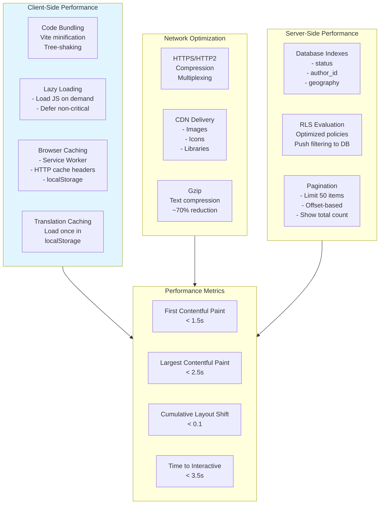
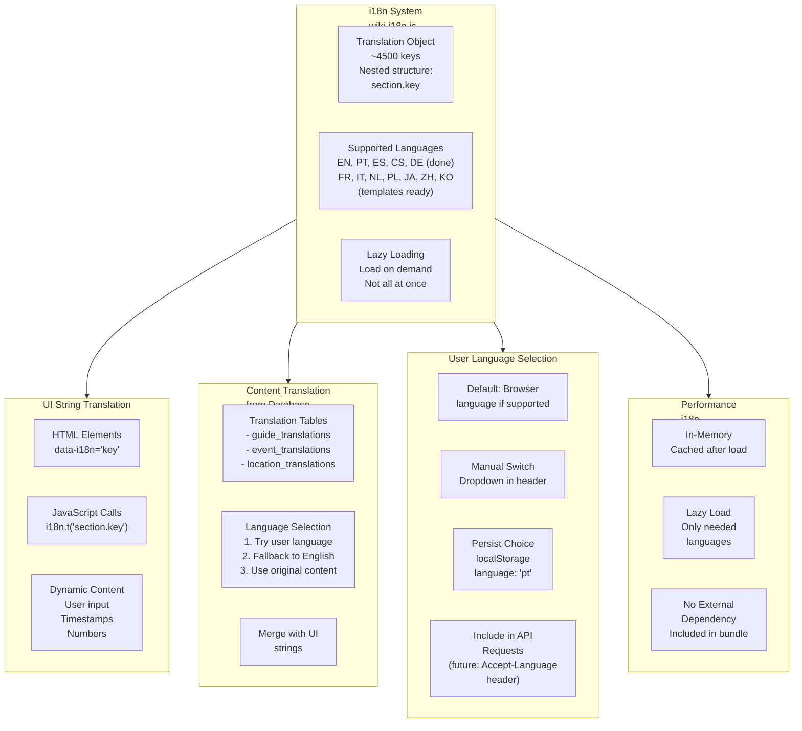
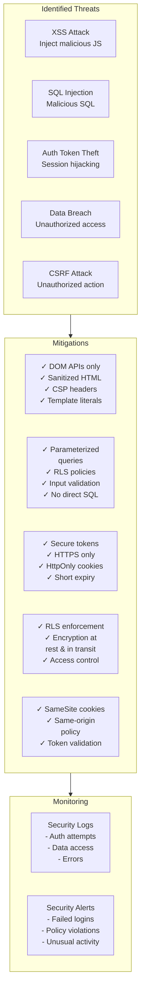

# Wiki Non-Functional Architecture

**File:** `/docs/architecture/WIKI_NONFUNCTIONAL_ARCHITECTURE.md`

**Description:** Non-functional requirements, quality attributes, and system design patterns for the Permahub Wiki

**Author:** Libor Ballaty <libor@arionetworks.com>

**Created:** 2025-11-21

---

## Overview

This document specifies non-functional requirements (NFRs) and quality attributes:
- Performance characteristics and optimization strategies
- Security model and threat mitigation
- Scalability and reliability patterns
- Internationalization (i18n) architecture
- Offline capabilities and PWA implementation
- Testing and monitoring strategies

---

## Diagram 1: Performance Architecture

---

## Diagram 2: Security Model

```mermaid
graph TD
    subgraph Auth["Authentication<br/>& Authorization"]
        Supabase["Supabase Auth<br/>- Email/password<br/>- Magic links<br/>- OAuth (configured)"]

        Session["Session Management<br/>- JWT tokens<br/>- localStorage<br/>- Auto-refresh"]

        RLS["Row-Level Security<br/>Database policies<br/>auth.uid() checks"]
    end

    subgraph DataSec["Data Security"]
        HTTPS["HTTPS Only<br/>All traffic encrypted<br/>TLS 1.3+"]

        ReferenceIntegrity["Referential Integrity<br/>- Foreign keys<br/>- Cascading deletes<br/>- NOT NULL constraints"]

        Validation["Input Validation<br/>- Client-side<br/>- Server-side (RLS)<br/>- SQL injection prevention<br/>(parameterized queries)"]
    end

    subgraph WebSec["Web Security"]
        XSS["XSS Prevention<br/>- No innerHTML<br/>- Sanitized output<br/>- Content Security Policy"]

        CSRF["CSRF Prevention<br/>- Same-origin requests<br/>- Token validation"]

        Headers["Security Headers<br/>- X-Content-Type-Options<br/>- X-Frame-Options<br/>- Strict-Transport-Security"]
    end

    subgraph UserData["User Data Privacy"]
        PII["Personal Data<br/>- Email<br/>- Location<br/>- Profile info"]

        PublicControl["User Controls<br/>- is_public_profile flag<br/>- Privacy settings<br/>- Data deletion"]

        Compliance["GDPR Compliance<br/>- Right to access<br/>- Right to delete<br/>- Consent management"]
    end

    Auth --> DataSec
    DataSec --> WebSec
    WebSec --> UserData

    style Auth fill#ffcdd2
    style DataSec fill#ffe0b2
    style WebSec fill#fff9c4
    style UserData fill#f3e5f5
```

---

## Diagram 3: Scalability & Architecture

```mermaid
graph TB
    subgraph Frontend["Frontend Layer<br/>(Stateless)"]
        Static["Static Files<br/>- HTML<br/>- CSS<br/>- JS<br/>- Images"]

        CDN_Service["CDN Service<br/>Global distribution<br/>Edge caching"]

        Multiple["Multiple Instances<br/>- Scale horizontally<br/>- Load balanced<br/>- No server state"]
    end

    subgraph Backend["Backend Layer<br/>(Supabase)"]
        API["REST API<br/>Auto-scaling<br/>per request"]

        Auth_Service["Auth Service<br/>Managed by<br/>Supabase"]

        RLS_Engine["RLS Engine<br/>Policies evaluated<br/>per request"]
    end

    subgraph Database["Database Layer<br/>(PostgreSQL)"]
        Connection["Connection Pool<br/>25-30 connections<br/>per instance"]

        ReadReplicas["Read Replicas<br/>(optional)<br/>Scale reads<br/>separately"]

        Partitioning["Table Partitioning<br/>(future)<br/>- By created_at<br/>- By author_id"]

        Indexes["Indexes<br/>Status, author_id<br/>Geography (PostGIS)"]
    end

    subgraph Monitoring["Monitoring<br/>(Observability)"]
        Metrics["Performance Metrics<br/>- API response time<br/>- DB query time<br/>- RLS eval time"]

        Logs["Audit Logs<br/>- User actions<br/>- Data changes<br/>- Auth events"]

        Alerts["Alerts<br/>- High latency<br/>- Error rate<br/>- Rate limiting"]
    end

    Frontend --> Backend
    Backend --> Database
    Database --> Monitoring

    style Frontend fill#e1f5ff
    style Backend fill#e8f5e9
    style Database fill#fce4ec
    style Monitoring fill#fff3e0
```

---

## Diagram 4: Internationalization (i18n) Architecture

---

## Diagram 5: Offline Capabilities & PWA

```mermaid
graph TD
    subgraph ServiceWorker["Service Worker"]
        Register["pwa-register.js<br/>Register SW on load"]

        Cache["Cache Strategy<br/>- Cache first<br/>- Network fallback<br/>- Stale while revalidate"]

        Offline["Offline Page<br/>offline.html<br/>Show when no network"]
    end

    subgraph ManifestFile["Web App Manifest"]
        Name["Display info<br/>- name<br/>- short_name<br/>- description"]

        Icons["Icons<br/>- 192x192<br/>- 512x512<br/>- 192x192 maskable"]

        Theme["Theme colors<br/>- background_color<br/>- theme_color"]

        Display["Display Mode<br/>- standalone<br/>- fullscreen<br/>- minimal-ui"]
    end

    subgraph InstallPrompt["Installation"]
        Prompt["Add to Home<br/>Screen<br/>Mobile: Native prompt<br/>Desktop: Menu option"]

        Install["User Installs<br/>App icon on<br/>home screen"]

        Launch["Launch as App<br/>- Standalone mode<br/>- No browser UI<br/>- Full screen"]
    end

    subgraph Caching["Offline Access"]
        CacheTypes["Cached Items<br/>- HTML pages<br/>- CSS/JS<br/>- Recent content<br/>(limited)"]

        SyncQueue["Sync Queue<br/>(future)<br/>Queue actions<br/>when offline<br/>Sync when online"]

        LimitedAccess["Limited Functionality<br/>✓ Read cached<br/>✗ Create new<br/>✗ Fetch new data"]
    end

    subgraph Indicators["User Indicators"]
        OnlineStatus["Online Status<br/>navigator.<br/>onLine<br/>Show/hide based"]

        SyncStatus["Sync Status<br/>- Connected<br/>- Offline<br/>- Syncing<br/>- Error"]

        Message["User Message<br/>'Changes will sync<br/>when online'"]
    end

    ServiceWorker --> ManifestFile
    ManifestFile --> InstallPrompt
    InstallPrompt --> Caching
    Caching --> Indicators

    style ServiceWorker fill#e1f5ff
    style ManifestFile fill#fff3e0
    style InstallPrompt fill#e8f5e9
    style Caching fill#f3e5f5
    style Indicators fill#bbdefb
```

---

## Diagram 6: Reliability & High Availability

```mermaid
graph TB
    subgraph Uptime["Uptime Target"]
        Nines["Four Nines<br/>99.99% uptime<br/>≈52 minutes downtime<br/>per year"]

        Factors["Achieved through:<br/>- Managed infrastructure<br/>- Redundancy<br/>- Automatic failover"]
    end

    subgraph ErrorHandling["Error Handling"]
        ClientError["Client-Side<br/>- Try/catch blocks<br/>- Graceful fallback<br/>- User-friendly messages"]

        NetworkError["Network Error<br/>- Retry logic<br/>- Exponential backoff<br/>- Timeout handling"]

        ServerError["Server-Side<br/>- Error logs<br/>- Stack traces<br/>- User notification"]
    end

    subgraph Recovery["Recovery Strategy"]
        TokenRefresh["Token Refresh<br/>- Auto-refresh<br/>before expiry<br/>- Re-authenticate<br/>if needed"]

        Reconnect["Reconnection<br/>- Detect offline<br/>- Queue actions<br/>- Sync on reconnect"]

        DataConsistency["Data Consistency<br/>- ACID guarantees<br/>- Rollback on error<br/>- Transaction support"]
    end

    subgraph Monitoring_["Monitoring<br/>& Alerting"]
        ErrorTracking["Error Tracking<br/>- Log errors<br/>- Send alerts<br/>- Track patterns"]

        Performance_Mon["Performance<br/>Monitoring<br/>- API latency<br/>- Error rates<br/>- DB query time"]

        HealthCheck["Health Checks<br/>- API availability<br/>- DB connectivity<br/>- Auth service"]
    end

    Uptime --> ErrorHandling
    ErrorHandling --> Recovery
    Recovery --> Monitoring_

    style Uptime fill#fff9c4
    style ErrorHandling fill#ffcdd2
    style Recovery fill#c8e6c9
    style Monitoring_ fill#bbdefb
```

---

## Diagram 7: Testing Strategy

```mermaid
graph TB
    subgraph Unit["Unit Tests"]
        Scope["Test scope:<br/>- Utility functions<br/>- i18n lookups<br/>- Distance calc"]

        Tool["Tool: Vitest"]

        Coverage["Target: 80%<br/>coverage"]
    end

    subgraph Integration["Integration Tests"]
        Scope2["Test scope:<br/>- Module interactions<br/>- API calls<br/>- Form validation"]

        Tool2["Tool: Vitest"]

        Coverage2["Target: 70%<br/>coverage"]
    end

    subgraph E2E["End-to-End Tests"]
        Scope3["Test scope:<br/>- Complete user flows<br/>- Page navigation<br/>- Auth flows"]

        Tool3["Tool: Playwright<br/>(configured)"]

        Coverage3["Critical paths:<br/>- Browse content<br/>- Create guide<br/>- Map interaction"]
    end

    subgraph Manual["Manual Testing"]
        Scope4["Test scope:<br/>- UI/UX quality<br/>- Responsive design<br/>- Cross-browser"]

        Checklist["Checklist:<br/>WIKI_UI_REGRESSION<br/>_TESTING_CHECKLIST.md"]

        Before["Before release:<br/>- Chrome<br/>- Safari<br/>- Firefox<br/>- Mobile"]
    end

    subgraph Automated["Automated Checks"]
        Linting["Linting<br/>- Code style<br/>- No console errors<br/>- Best practices"]

        Security["Security<br/>- npm audit<br/>- Dependency check<br/>- No secrets"]

        Build["Build<br/>- npm run build<br/>- No errors<br/>- File sizes OK"]
    end

    Unit --> Integration
    Integration --> E2E
    E2E --> Manual
    Manual --> Automated

    style Unit fill#e1f5ff
    style Integration fill#fff3e0
    style E2E fill#e8f5e9
    style Manual fill#f3e5f5
    style Automated fill#bbdefb
```

---

## Diagram 8: Security Threat Mitigation

---

## Non-Functional Requirements Specification

### Performance Requirements

| Metric | Target | Measurement | Tool |
|--------|--------|-------------|------|
| First Contentful Paint (FCP) | < 1.5s | 75th percentile | Lighthouse |
| Largest Contentful Paint (LCP) | < 2.5s | 75th percentile | Lighthouse |
| Cumulative Layout Shift (CLS) | < 0.1 | 75th percentile | Lighthouse |
| Time to Interactive (TTI) | < 3.5s | 90th percentile | Lighthouse |
| API Response Time | < 500ms | Median | Cloudflare/Supabase logs |
| Database Query Time | < 100ms | 95th percentile | Supabase dashboard |
| Page Load Time | < 2s | Complete load | Browser DevTools |

### Security Requirements

| Category | Requirement | Implementation |
|----------|-------------|-----------------|
| Authentication | Multi-factor auth option | Email + password + magic links |
| Encryption | HTTPS/TLS | All traffic encrypted |
| Authorization | Role-based access control | RLS policies + is_admin flag |
| Data Privacy | GDPR compliance | User consent, right to delete |
| Input Validation | Server-side validation | RLS + constraint checks |
| Session Management | Secure tokens | JWT, short expiry, refresh token |

### Scalability Requirements

| Aspect | Requirement | Current Capacity |
|--------|-------------|------------------|
| Concurrent Users | 1000+ simultaneous | Supabase managed scaling |
| Data Size | 10GB+ content | PostgreSQL scaling |
| Requests/Second | 100+ req/s | Auto-scaling API |
| Geographic Distribution | Global CDN | Vercel/Netlify global |

### Reliability Requirements

| Aspect | Requirement | Target |
|--------|-------------|--------|
| Uptime | 99%+ availability | 99.9% with Supabase |
| Data Durability | No data loss | ACID, backups |
| Recovery Time | RTO < 1 hour | Automated backup restore |
| Recovery Point | RPO < 15 minutes | Continuous replication |

### Usability Requirements

| Aspect | Requirement | Implementation |
|--------|-------------|-----------------|
| Responsive Design | Works on all devices | Mobile-first CSS |
| Accessibility | WCAG 2.1 AA | Semantic HTML, ARIA labels |
| Internationalization | 11 languages | Client-side i18n system |
| Offline Support | PWA capable | Service Worker, cache |

---

## Quality Gates

### Before Deployment
- [ ] Lighthouse score ≥ 90
- [ ] No console errors
- [ ] All tests passing
- [ ] Security audit clean (npm audit)
- [ ] Performance budget met
- [ ] Accessibility audit ≥ 90

### Before Release to Production
- [ ] Manual testing complete
- [ ] Cross-browser testing done
- [ ] Mobile testing on real devices
- [ ] Monitoring configured
- [ ] Backup verified
- [ ] Rollback plan documented

---

## Related Documents

- [WIKI_SYSTEM_ARCHITECTURE.md](./WIKI_SYSTEM_ARCHITECTURE.md) - System implementation
- [WIKI_DATA_MODEL.md](./WIKI_DATA_MODEL.md) - Data security
- [WIKI_DEPLOYMENT_ARCHITECTURE.md](./WIKI_DEPLOYMENT_ARCHITECTURE.md) - Deployment strategy
- [/docs/testing/WIKI_EDITOR_TEST_PLAN.md](../testing/WIKI_EDITOR_TEST_PLAN.md) - Test details

---

**Status:** Complete

**Last Review:** 2025-11-21
