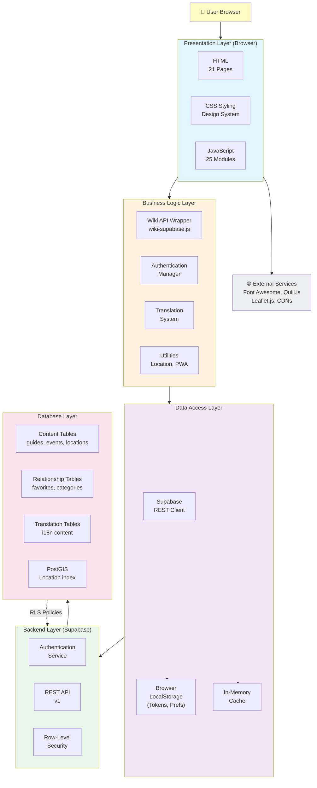
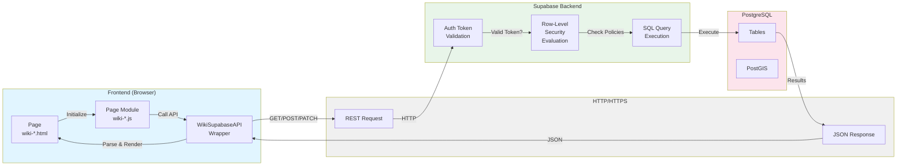
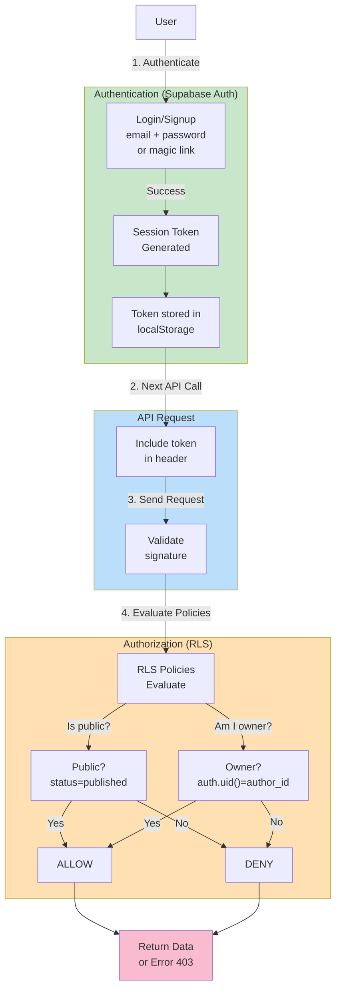
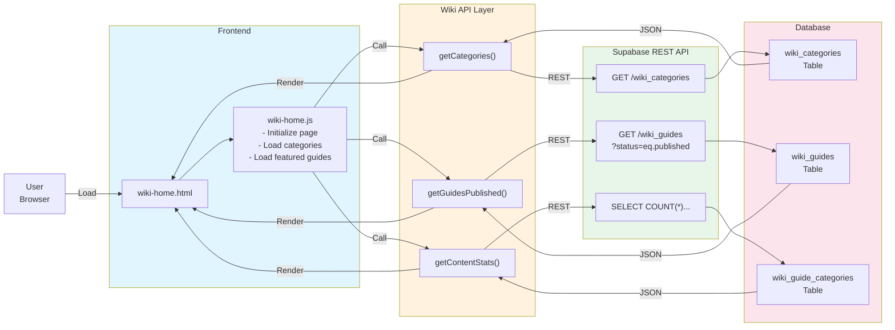
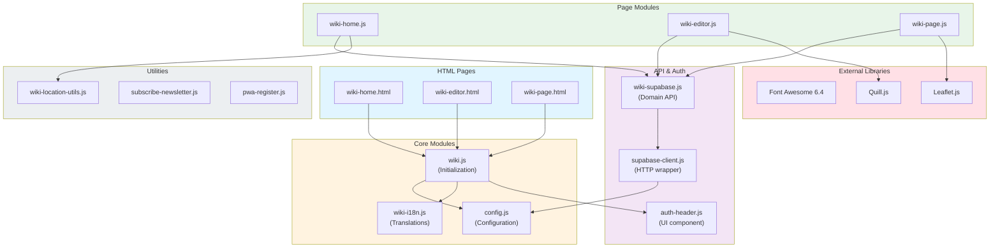
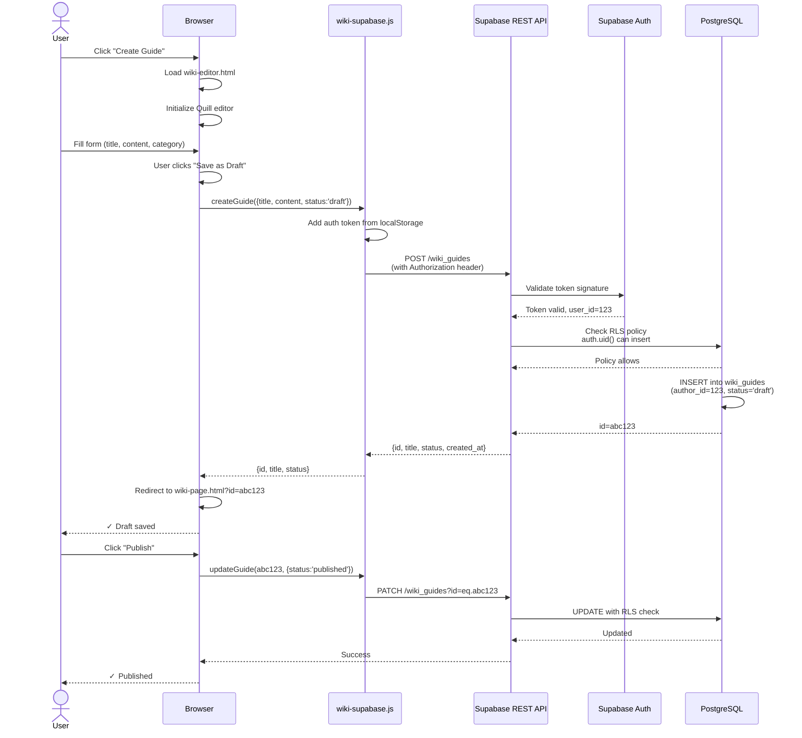
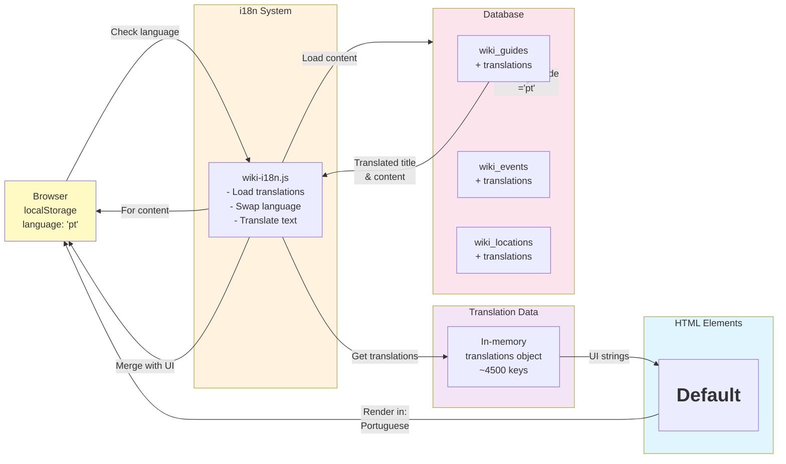
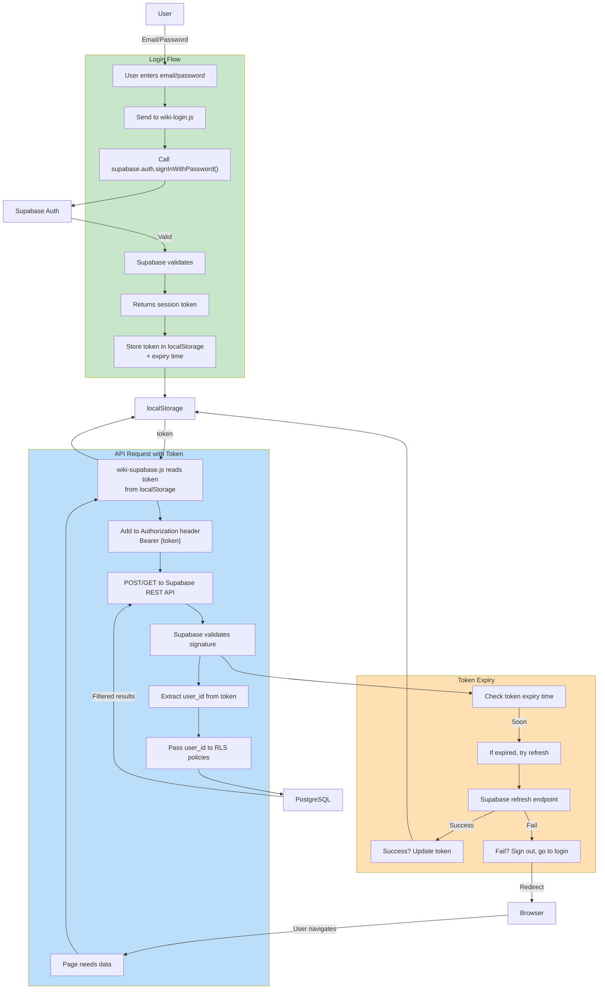
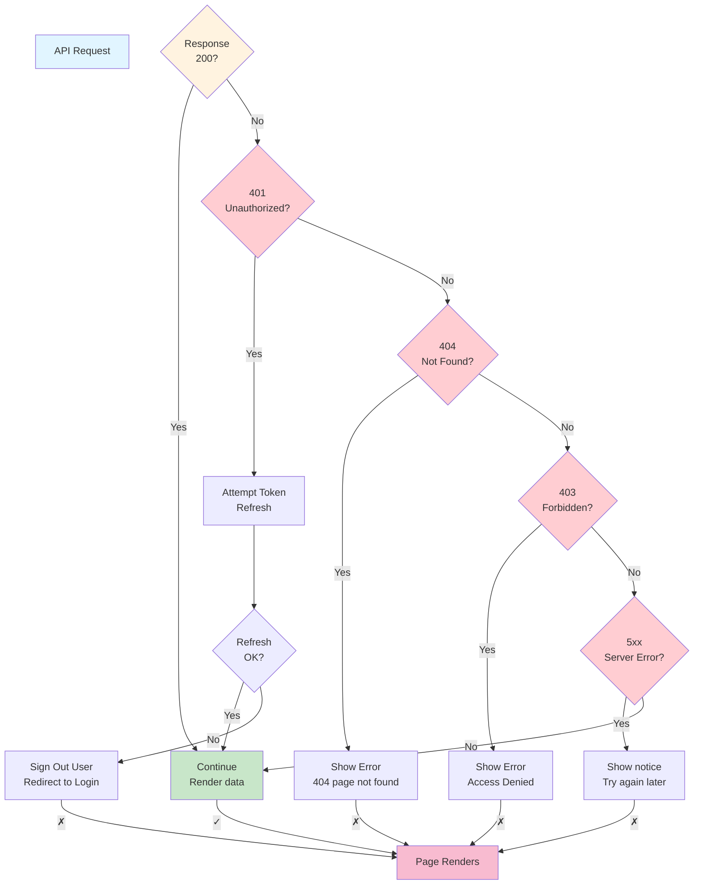

# Wiki System Architecture

**File:** `/docs/architecture/WIKI_SYSTEM_ARCHITECTURE.md`

**Description:** System-level architecture diagrams and integration patterns for the Permahub Wiki

**Author:** Libor Ballaty <libor@arionetworks.com>

**Created:** 2025-11-21

---

## Overview

This document contains system-level architecture diagrams showing:
- Layered system architecture
- Frontend-Backend integration
- Authentication and authorization flows
- External service dependencies
- Request-response patterns

---

## Diagram 1: Layered System Architecture

---

## Diagram 2: Frontend-Backend Integration

---

## Diagram 3: Authentication & Authorization Flow

---

## Diagram 4: Data Flow - Content Discovery

---

## Diagram 5: Module Dependency Chain

---

## Diagram 6: Content Creation & Editing Flow

---

## Diagram 7: Translation & Localization Architecture

---

## Diagram 8: Session & Token Management

---

## Diagram 9: Error Handling & Recovery

---

## Key Integration Points

### 1. Supabase REST API
- **Base URL:** `https://mcbxbaggjaxqfdvmrqsc.supabase.co/rest/v1/`
- **Authentication:** Bearer token in Authorization header
- **Response Format:** JSON with optional header params (count, etc.)
- **Error Codes:** Follow HTTP standard (400, 401, 403, 404, 500, etc.)

### 2. Browser APIs Used
- **localStorage:** Persist user auth tokens and preferences
- **sessionStorage:** Temporary state during page transitions
- **fetch:** All HTTP requests to Supabase
- **EventTarget:** Custom events for component communication

### 3. Database Constraints
- All tables have RLS enabled
- Foreign key relationships maintain referential integrity
- PostGIS geography column enables location-based queries
- Cascading deletes where appropriate (e.g., guide → categories)

### 4. External Services
- **Font Awesome 6.4:** Icon library via CDN
- **Quill.js:** Rich text editor for content
- **Leaflet.js:** Map display and interaction
- **OpenStreetMap:** Tile provider for Leaflet

---

## Performance Characteristics

| Operation | Performance | Notes |
|-----------|-------------|-------|
| Page load | <2s | CSS inline, JS bundled by Vite |
| Content search | <500ms | Supabase indexes on commonly searched fields |
| Map render | <1s | Markers lazy-loaded, map tiles cached |
| Location distance | <100ms | PostGIS spatial index, haversine fallback |
| Language switch | <200ms | In-memory translation swap |
| Image load | Variable | CDN hosted, browser cached |

---

## Related Documents

- [WIKI_COMPONENT_ARCHITECTURE.md](./WIKI_COMPONENT_ARCHITECTURE.md) - Component details
- [WIKI_DATA_MODEL.md](./WIKI_DATA_MODEL.md) - Data structures
- [WIKI_FRONTEND_DESIGN.md](./WIKI_FRONTEND_DESIGN.md) - Frontend patterns
- [WIKI_NONFUNCTIONAL_ARCHITECTURE.md](./WIKI_NONFUNCTIONAL_ARCHITECTURE.md) - NFRs

---

**Status:** Complete

**Last Review:** 2025-11-21
