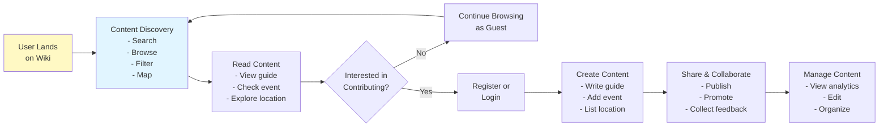
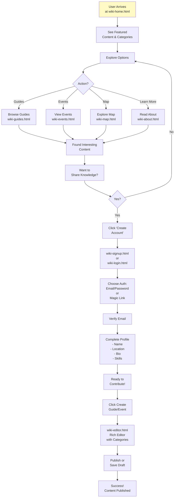
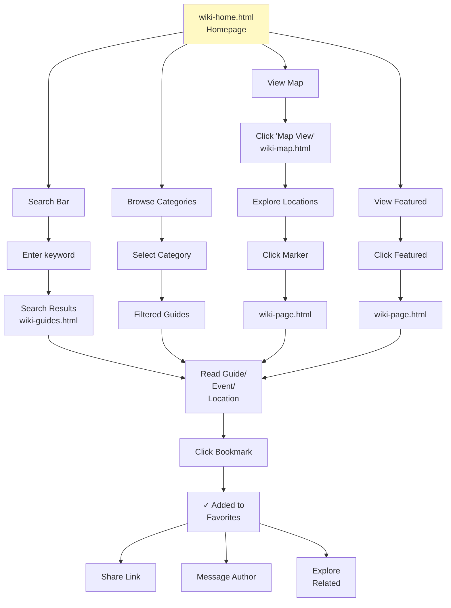
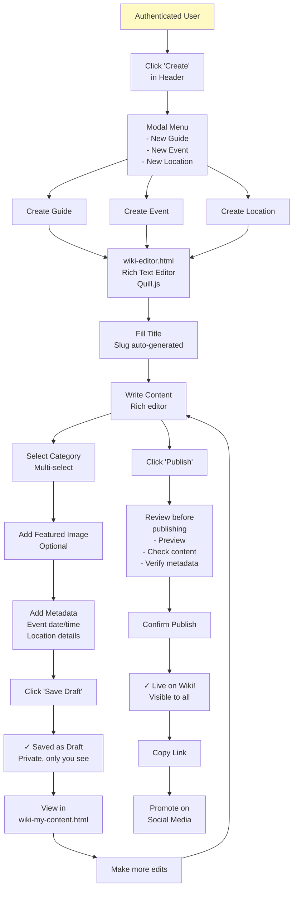
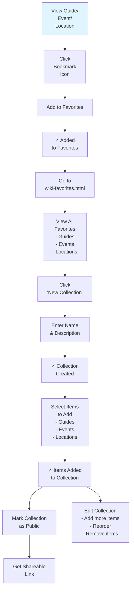
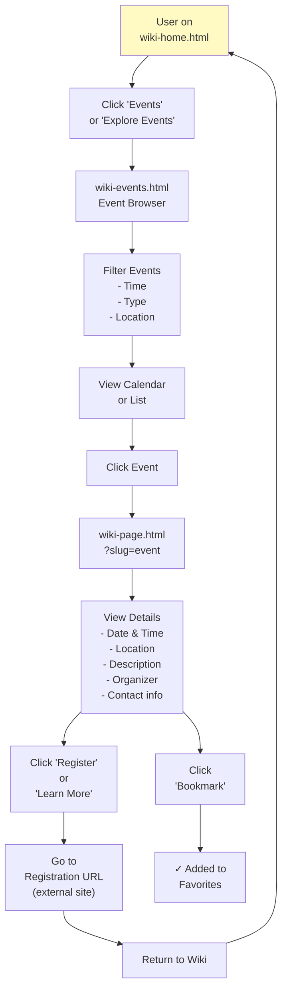
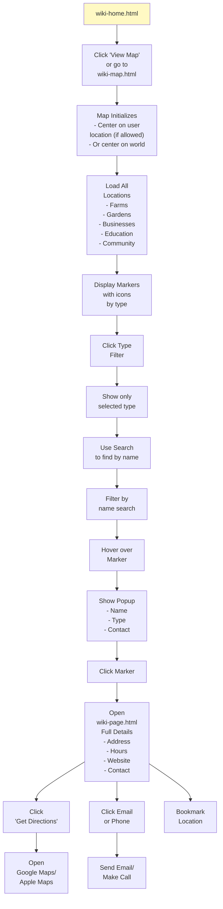
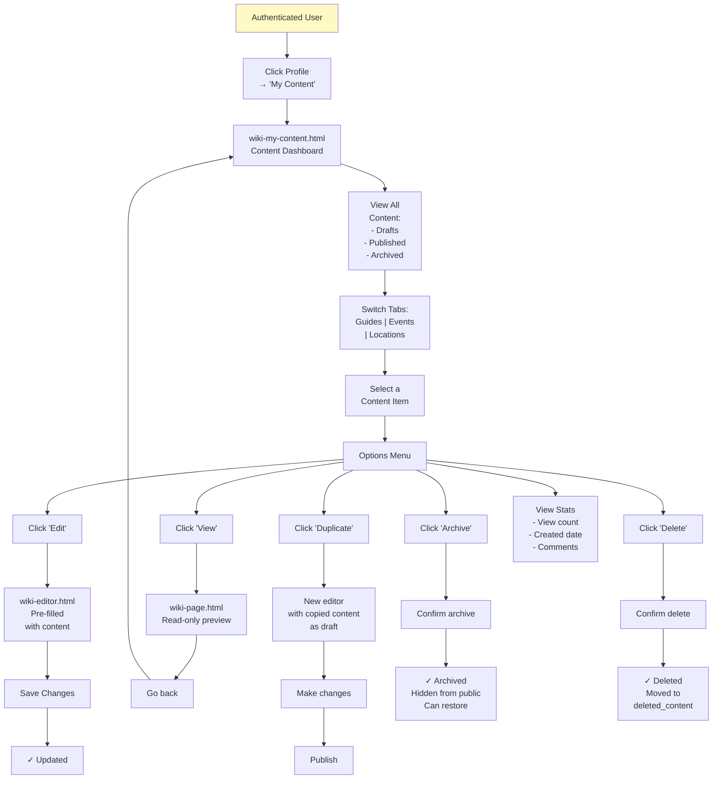
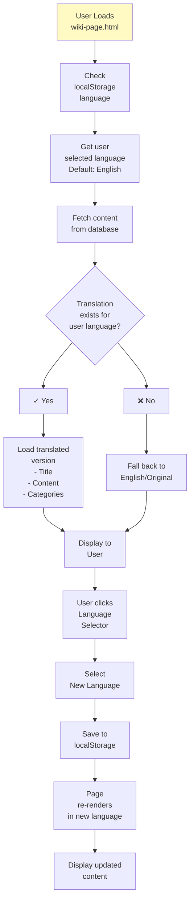

# Wiki User Flows & Interactions

**File:** `/docs/architecture/WIKI_USER_FLOWS.md`

**Description:** Detailed user journey diagrams, interaction flows, and use case scenarios for the Permahub Wiki

**Author:** Libor Ballaty <libor@arionetworks.com>

**Created:** 2025-11-21

---

## Overview

This document contains detailed user flow diagrams showing:
- Main user journeys
- Content discovery flows
- Creation and editing workflows
- Authentication flows
- Personalization and collection features

---

## Diagram 1: User Journey Overview



---

## Diagram 2: First-Time User Onboarding



---

## Diagram 3: Content Discovery Flow



---

## Diagram 4: Content Creation Workflow



---

## Diagram 5: Authentication Flow

```mermaid
sequenceDiagram
    participant User as User<br/>Browser
    participant Wiki as Wiki Frontend<br/>wiki-login.html
    participant Auth as Supabase<br/>Auth Service
    participant DB as PostgreSQL<br/>Users Table

    User->>Wiki: 1. Click 'Login'
    Wiki->>Wiki: Load login page
    Wiki->>Wiki: Show auth options

    User->>Wiki: 2a. Choose<br/>Email/Password
    Wiki->>Wiki: Show email/password form
    User->>Wiki: Enter credentials
    Wiki->>Auth: POST /auth/v1/token<br/>(email, password)

    Auth->>DB: Look up user
    DB-->>Auth: User found
    Auth->>Auth: Compare password hash
    Auth-->>Wiki: 200 OK<br/>(access_token, refresh_token)

    Wiki->>Wiki: Store token in<br/>localStorage
    Wiki->>Wiki: Redirect to<br/>wiki-home.html
    Wiki-->>User: ✓ Login successful

    User->>Wiki: 2b. Choose<br/>Magic Link
    Wiki->>Wiki: Show email form
    User->>Wiki: Enter email
    Wiki->>Auth: POST /auth/v1/otp<br/>(email)
    Auth->>Auth: Generate one-time<br/>link
    Auth->>User: Email with<br/>magic link
    User->>User: Click link in email
    Wiki->>Auth: /auth/v1/verify (token)
    Auth-->>Wiki: 200 OK<br/>(session created)
    Wiki-->>User: ✓ Authenticated!

    note over Wiki,DB
        Token stored for future requests
        Automatic token refresh on expiry
    end
```

---

## Diagram 6: Favorites & Collections Flow



---

## Diagram 7: Event Participation Flow



---

## Diagram 8: Geographic Discovery Flow



---

## Diagram 9: Content Management Workflow



---

## Diagram 10: Multi-Language Content Experience



---

## Use Cases Summary

| Use Case | Actor | Goal | Steps |
|----------|-------|------|-------|
| Browse Content | Anonymous User | Find useful guides and events | Home → Search/Filter → Read → Save/Share |
| Create Guide | Authenticated User | Share knowledge | Login → Create → Write → Publish |
| Discover Locations | Any User | Find permaculture projects nearby | View Map → Filter → Explore Details |
| Organize Content | Authenticated User | Curate content collections | Favorites → Create Collection → Add Items |
| Participate in Event | Any User | Register for workshop/meetup | View Events → Select → Register via link |
| Manage Content | Content Creator | Maintain published content | My Content → Select → Edit/Archive/Delete |
| Provide Feedback | Any User | Report issues with content | Click Report → Submit Form |
| Access Offline | Any User | Use app without internet | Browser caches PWA → View cached content |

---

## Related Documents

- [WIKI_SYSTEM_ARCHITECTURE.md](./WIKI_SYSTEM_ARCHITECTURE.md) - Technical implementation of flows
- [WIKI_FRONTEND_DESIGN.md](./WIKI_FRONTEND_DESIGN.md) - UI components for flows
- [WIKI_DATA_MODEL.md](./WIKI_DATA_MODEL.md) - Data structures involved

---

**Status:** Complete

**Last Review:** 2025-11-21
